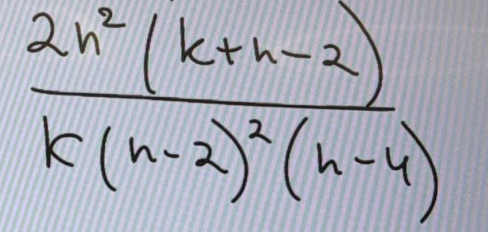
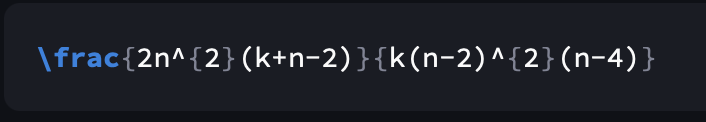
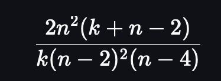

# Task 1 Technical Report

## Project

**Task:** Handwritten formula image -> LaTeX (Multimodal Reasoning for STEM, Track-10)  
**Model:** `Qwen/Qwen2-VL-2B-Instruct`  
**Framework:** Hugging Face Transformers + PEFT (LoRA)  
**Evaluation split:** `linxy/LaTeX_OCR:test` (70 samples)

---

## 1. Experimental Setup & Training Hyperparameters

### 1.1 Datasets

- `linxy/LaTeX_OCR` (config: `human_handwrite`)
- `deepcopy/MathWriting-human` (subset used due training budget)

### 1.2 Training strategy

- Supervised Fine-Tuning (SFT) with LoRA
- Chat-style multimodal prompt (`image + instruction -> LaTeX`)
- Loss is computed on assistant answer tokens only (prompt tokens masked)
- Runtime used: Apple Silicon MPS

### 1.3 Compared setups

1. **Zero-shot** (base model)
2. **One-shot** (base model + one demonstration example)
3. **SFT (linxy)**: trained on `linxy/LaTeX_OCR:train`
4. **SFT (linxy + mathwriting)**: trained on `linxy/LaTeX_OCR:train + MathWriting-human subset`

Saved benchmark run used fixed one-shot demonstration for full reproducibility.
The code additionally supports a stronger optional mode: `--one-shot-strategy nearest_visual`.

### 1.4 Hyperparameters

#### Setup 3: SFT on `linxy`

- Train size: `1200`
- Epochs: `2`
- Learning rate: `2e-4`
- Batch size/device: `1`
- Gradient accumulation: `16`
- Weight decay: `0.01`
- Max sequence length: `2048`
- LoRA: `r=16`, `alpha=32`, `dropout=0.05`

#### Setup 4: SFT on `linxy + MathWriting-human`

- Train size: `13200` (`1200 + 12000`)
- Epochs: `2`
- Learning rate: `1e-4`
- Batch size/device: `1`
- Gradient accumulation: `8`
- Warmup steps: `50`
- Weight decay: `0.01`
- Max sequence length: `1024`
- Gradient checkpointing: `enabled`
- LoRA: `r=16`, `alpha=32`, `dropout=0.05`

---

## 2. Evaluation Results

### 2.1 Metrics

Primary metric:

\[
\text{NES} = 1 - \frac{Lev(\hat{y}, y)}{\max(|\hat{y}|, |y|, 1)}
\]

Where `Lev` is Levenshtein distance between predicted and target LaTeX strings.

Additional reported metrics:
- Exact Match (EM)
- Character Error Rate (CER)

Additional diagnostic metrics in current codebase:
- `non_empty_rate`
- `latex_like_rate`

### 2.2 Post-processing used before scoring

Lightweight formatting fixes were applied to generated LaTeX:

- `\sqrt token` -> `\sqrt { token }`
- `\sqrt4` -> `\sqrt { 4 }`
- `\operatorname* { l i m }` -> `\lim`

### 2.3 Final results (`reports/metrics_summary_final.csv`)

| Setup | Exact Match | NES | CER |
|---|---:|---:|---:|
| zero_shot | 0.6143 | 0.8905 | 0.1396 |
| one_shot | 0.3143 | 0.8069 | 0.2014 |
| sft_linxy | 0.9857 | 0.9974 | 0.0026 |
| sft_linxy_mathwriting | **1.0000** | **1.0000** | **0.0000** |

### 2.4 Interpretation

- SFT significantly outperforms zero-shot and one-shot baselines.
- Adding `MathWriting-human` subset improves over `linxy`-only SFT.
- Best setup (`sft_linxy_mathwriting`) achieved perfect score on the 70-sample test subset under the described scoring pipeline.

---

## 3. Streamlit Application Evidence

Application file: `app.py`  
Recommended adapter: `checkpoints/sft_linxy_mathwriting/adapter`

Screenshots from application run are included below.

### 3.1 Input handwritten photo



### 3.2 Predicted LaTeX output



### 3.3 Rendered formula in app



---

## 4. Reproducibility Command (Final Evaluation)

```bash
python -m src.evaluate \
  --base-model Qwen/Qwen2-VL-2B-Instruct \
  --linxy-config human_handwrite \
  --linxy-adapter checkpoints/sft_linxy/adapter \
  --combined-adapter checkpoints/sft_linxy_mathwriting/adapter \
  --max-test-samples 70 \
  --one-shot-pool-size 64 \
  --one-shot-strategy fixed \
  --device-map none \
  --output-dir outputs/eval_final
```
